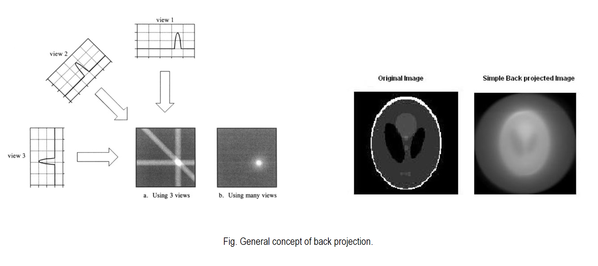
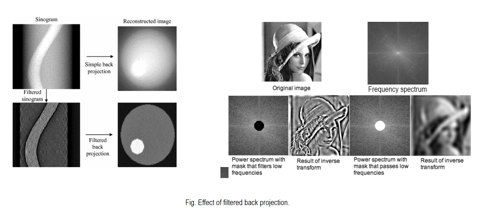
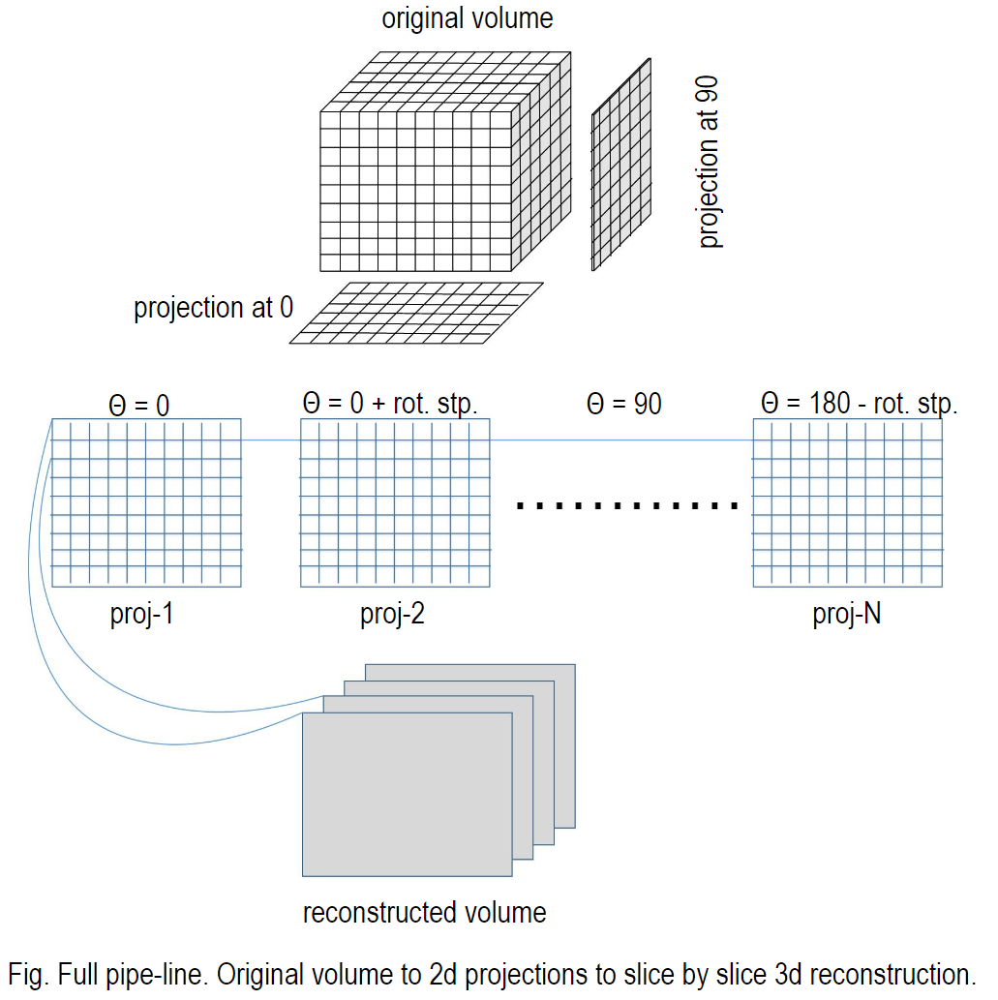
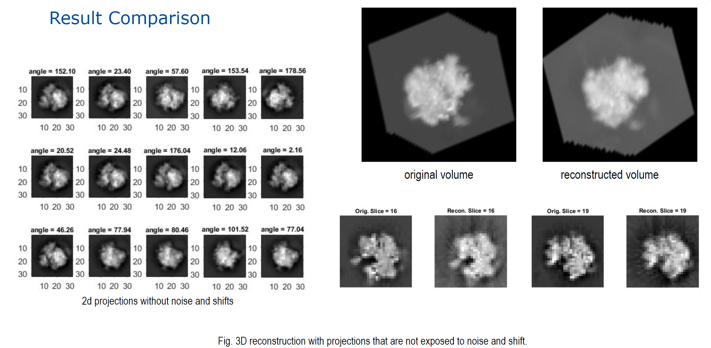

# 3D Reconstruction using 2D Projections

This is a raw implementation of 3D reconstruction using 2D projections in Matlab without using any built-in functions. The 2D projections are acquired using an example 3d volume.mat. To reconstruct the original 3D volume we need to know the angle of projections. Please look at my repository 2dProjection to know more about how 2D projections.
 The most used reconstruction is called the Back projection. The idea is to back project the acquired projections according to their corresponding angle to get the original object. Here is an visual interpretation. 

### Back Projection

The generated output of this method suffers from the halo effect due to over accumulation of overlapping projections. To tackle the issue the general approach is to use filtered back projections where sinograms of projections are filtered using some weights so high relevance frequency gets more attention in the accumulation process.  

### Filtered-Back Projection 

This same idea is used to reconstruct a 3D volume. In the following example all the slices are reconstructed individually then stacked to make a 3D volume. 

### 3D reconstruction

# How to use the functions 
As I mentioned before this is a complete own implementation of 3D reconstruction without using any built-in matlab functions. 
The reconstuction is done in frequency space so function like Fourier Transform, Inverse Fourier Transform, fftshift, weighted filter are implemented as well. Please look in the repository for specific files. 

> - step 1. first run "projectionsOf3dVolume.m" for generating 2D projections. Get the file from [2dProjection](https://github.com/mrahmansagar/2dProjection) .  
> - step 2. then run "reconstructionOf3dVolume.m" for reconstructing 3D volume using 2D projections from step 1.

optional:
After step 2. "reconstructedVolume.mat" will be saved in the current directory. Then you can run "comparison.m" to see the result. 
This script loads original and reconstructed volume, then plots 5 figures with randomly selected slices for side by side comparison.

> #### Running script "reconstructionOf3dVolume.m" does the followings:
    > - loads the 2d projections and corresponding angles from the folder "2dProjections". [section: Projection loading]
    > - reconstructs 3D volume from the 2D projections. [section: Volume reconstruction] 
    > - saves the reconstructed volume to the current working directory as "reconstructedVolume.mat". [section: Save the reconstructed volume]

If you need the example volume that I used (volume.mat) please contact me.

